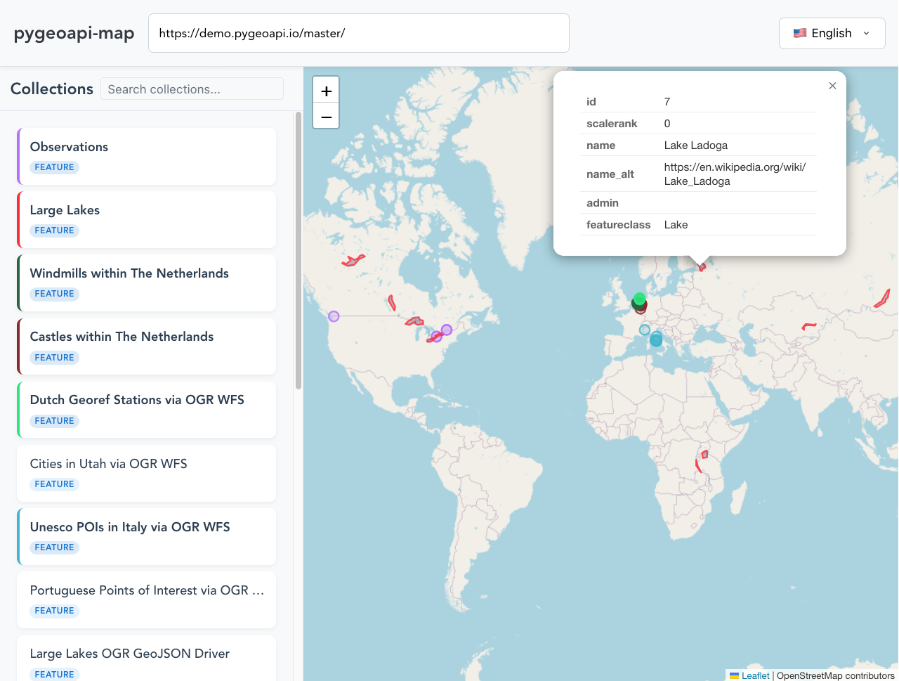

# pygeoapi-map

A modern, multilingual web application for visualizing and interacting with PyGeoAPI collections. Built with Vue.js and Leaflet, it provides an intuitive interface for exploring geospatial data served through PyGeoAPI.



## Features

- 🌍 Interactive map visualization using Leaflet
- 🎨 Dynamic collection styling with auto-generated colors
- 🌐 Multilingual support (en-US, ar-EG)
- 🔄 Real-time collection toggling
- 📱 Responsive design
- ⚡ Dynamic server URL configuration
- 🎯 Automatic zoom to collection bounds
- 💾 Persistent user preferences

## Supported Collection Types

- ✅ OGC API - Features (GeoJSON)
- ⬜️ OGC API - Coverages
- ⬜️ OGC API - Tiles (Vector Tiles)
- ⬜️ OGC API - Records (Display BBOX Features)

## Quick Start

### Using Docker

1. Create a `config.json` file:

```json
{
  "server": {
    "url": "https://demo.pygeoapi.io/master/"
  },
  "i18n": {
    "defaultLocale": "en-US",
    "supportedLocales": [
      {
        "code": "en-US",
        "name": "English",
        "flag": "🇺🇸",
        "direction": "ltr",
        "headerTitle": "pygeoapi-map"
      },
      {
        "code": "ar-EG",
        "name": "العربية",
        "flag": "🇪🇬",
        "direction": "rtl",
        "headerTitle": "خريطة pygeoapi"
      }
    ]
  }
}
```

2. Run using Docker:

```bash
docker run -d \
  --name pygeoapi-map \
  -p 8080:80 \
  -v $(pwd)/config.json:/srv/config.json:ro \
  ghcr.io/youssef-harby/pygeoapi-map:latest
```

### Using Docker Compose

1. Create a `docker-compose.yml` file:

```yaml
services:
  pygeoapi-map:
    image: ghcr.io/youssef-harby/pygeoapi-map:latest
    container_name: pygeoapi-map
    ports:
      - "8080:80"
    volumes:
      - ./config.json:/srv/config.json:ro
```

2. Run using Docker Compose:

```bash
docker compose up -d
```

The application will be available at `http://localhost:8080`

## Development Setup

1. Clone the repository:
```bash
git clone https://github.com/youssef-harby/pygeoapi-map.git
cd pygeoapi-map
```

2. Install dependencies:
```bash
npm install
```

3. Create a `public/config.json` file with your PyGeoAPI server configuration.

4. Start the development server:
```bash
npm run serve
```

5. Build for production:
```bash
npm run build
```

## Configuration

The `config.json` file supports the following options:

```json
{
  "server": {
    "url": "https://demo.pygeoapi.io/master"  // Your PyGeoAPI server URL
  },
  "i18n": {
    "defaultLocale": "en-US",          // Default language
    "supportedLocales": [              // Available languages
      {
        "code": "en-US",
        "name": "English",
        "flag": "🇺🇸",
        "direction": "ltr",
        "headerTitle": "pygeoapi-map"  // Header title in English
      }
    ]
  }
}
```

## Contributing

1. Fork the repository
2. Create your feature branch: `git checkout -b feature/my-new-feature`
3. Commit your changes: `git commit -am 'Add some feature'`
4. Push to the branch: `git push origin feature/my-new-feature`
5. Submit a pull request

## License

This project is licensed under the MIT License - see the [LICENSE](LICENSE) file for details.

## Acknowledgments

- [PyGeoAPI](https://pygeoapi.io/) for the amazing geospatial server
- [Vue.js](https://vuejs.org/) for the reactive frontend framework
- [Leaflet](https://leafletjs.com/) for the mapping capabilities
